## TABLA DE ZAPATERÍA
#### creamos una tabla de datos
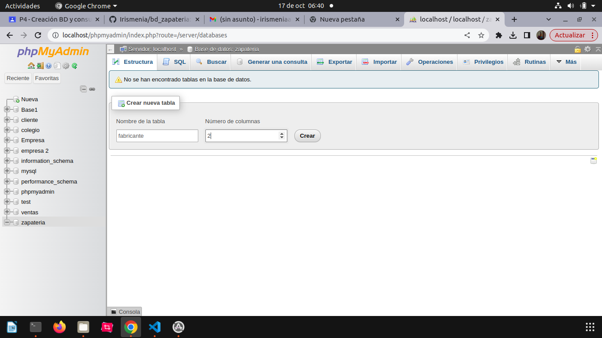
 ### luego ponemos los documentos de la tabla
 
 ### Y así se vería
 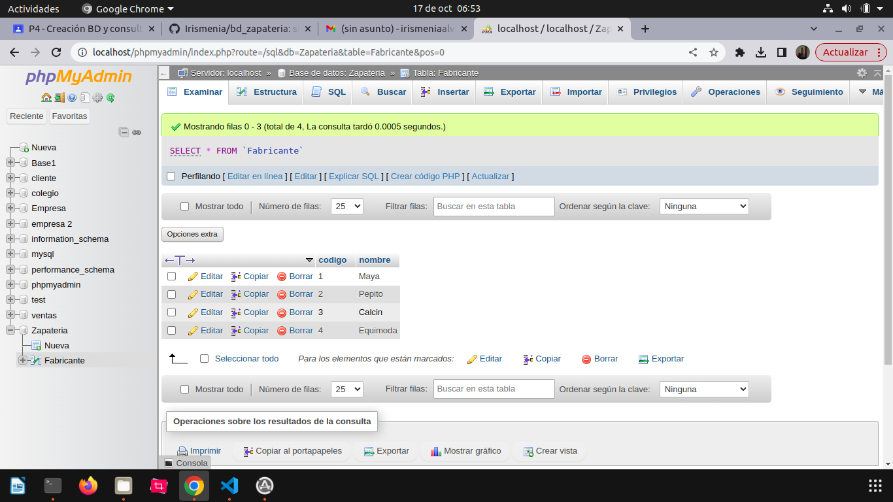
 ### luego creamos otra tabla llamada Articulos 
 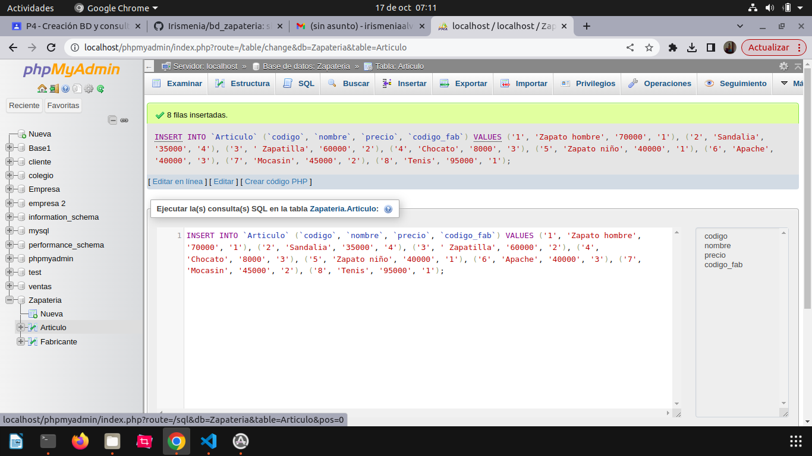
 ### Y a lo ultimocrearemos una relación 
 
 ### Ya culminando se vería así
  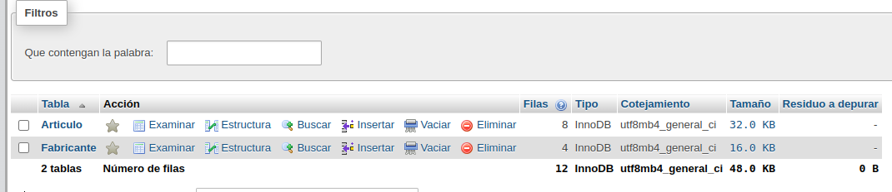

## TALLER DE CLASES
1# 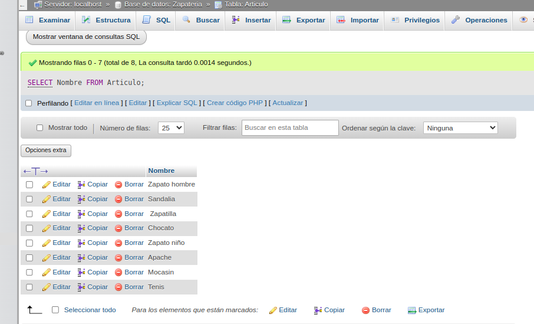

2# 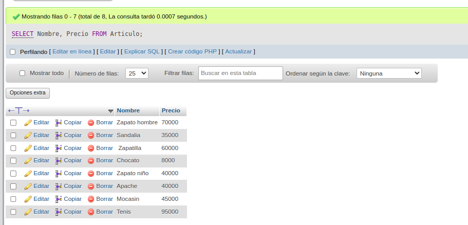

3# 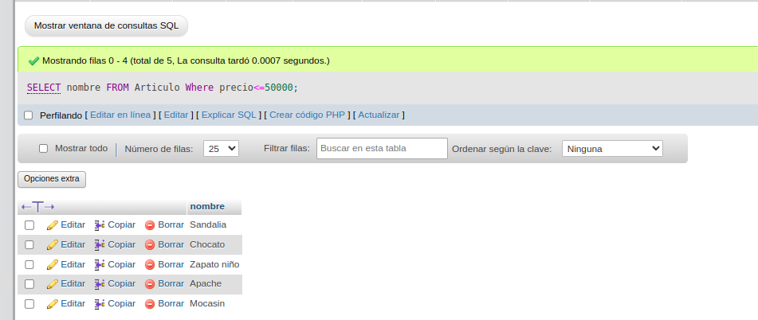

4# 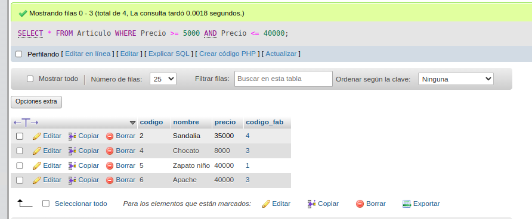

5# 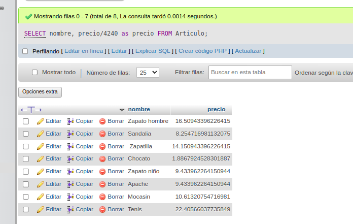

6# 

7# 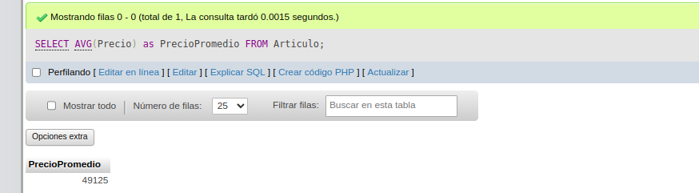

8# 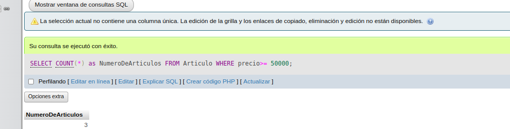

9# 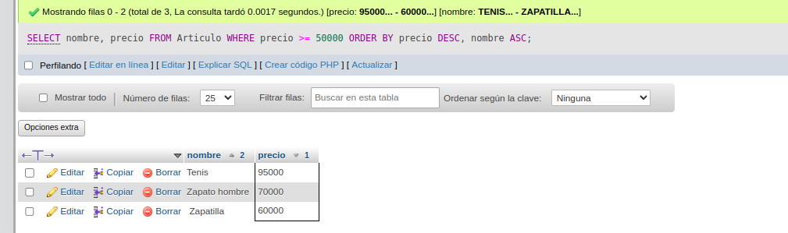

10# 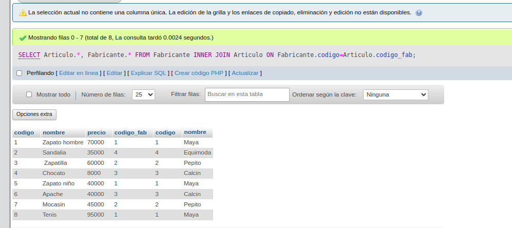